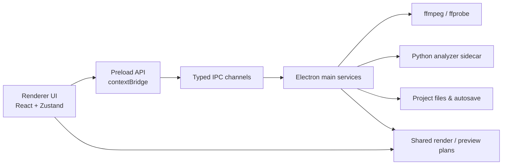

<p align="center">
  
</p>

<h1 align="center">BeatStride</h1>

<p align="center">
  面向跑步听歌场景的桌面音频工具：分析 BPM、对齐拍点、叠加节拍器，并导出适合训练节奏的单曲或串烧。
</p>

<p align="center">
  
  
  
  
  
</p>

---

## 目录

- [项目简介](#项目简介)
- [核心特性](#核心特性)
- [快速开始](#快速开始)
- [推荐工作流](#推荐工作流)
- [项目结构](#项目结构)
- [架构概览](#架构概览)
- [音频与分析资源](#音频与分析资源)
- [常用脚本](#常用脚本)
- [测试与质量检查](#测试与质量检查)
- [打包发布](#打包发布)
- [已知限制](#已知限制)
- [路线图](#路线图)
- [参与贡献](#参与贡献)
- [许可证](#许可证)

## 项目简介

BeatStride 是一个基于 **Electron + React + TypeScript** 的桌面端音频处理工具。它围绕「跑步听歌」这个具体场景设计：导入本地音乐后，应用会分析曲目 BPM 与拍号，给出更适合目标步频的变速方案，并在试听和导出阶段把节拍器与原曲拍点对齐。

相比简单地把歌曲整体拉伸到某个 BPM，BeatStride 更关注 **downbeat / 首拍偏移、节拍器起始偏移、半拍/倍拍映射、舒适目标 BPM** 等影响跑步听感的细节。

> 项目当前处于早期迭代阶段，优先面向 Windows 开发环境；macOS 打包目标已保留，但跨平台资源路径仍需要进一步验证。

## 核心特性

### 音频导入与分析

- 本地音频文件导入，支持按钮选择与拖拽导入。
- 使用 `ffprobe` 读取音频元数据。
- 导入阶段自动 BPM 分析，并支持对单曲重新分析。
- Python analyzer sidecar 支持更细的曲目分析与对齐建议，可检测 / 推断 `3/4`、`4/4`、`6/8` 等拍号信息。
- 无 analyzer 可用时自动回退到 ffmpeg 侧 BPM 检测链路。

### 拍点对齐与跑步节奏

- 轨道级参数编辑：`sourceBpm`、`targetBpm`、`downbeatOffset`、`metronomeOffset`、`trim`、`fade`、`volume`、`pan`。
- 半拍 / 倍拍映射与全局目标 BPM 策略。
- 针对 `100-125 BPM` 歌曲提供舒适目标（如 120 BPM）策略，避免过度拉伸。
- 支持音乐目标 BPM 与节拍器 BPM 分离：例如歌曲温和拉到 120 BPM，节拍器仍以 180 BPM 打点。
- 生成统一 render plan，确保预览与导出的对齐规则一致。

### 试听与波形预览

- 单曲试听 / 串烧试听。
- 原曲对比 / 变速试听 / 节拍器叠加模式热切换。
- 可缩放真实波形预览与拍点可视化。
- 传输控制：后退 10 秒、播放、暂停、停止、前进 10 秒。
- 支持音量控制、进度条点击与拖动定位、已播放区间提示。
- 对 Chromium 不易直接播放的格式（如部分 `m4a`）自动生成内部播放代理。

### 工程、代理与导出

- 工程文件保存 / 打开与自动保存恢复。
- 工作区整行单选、复选框多选、拖拽排序。
- 项目级素材代理生成：显示未生成 / 生成中 / 已生成 / 已过期状态。
- 单曲导出：变速、节拍器叠加、可选 loudnorm。
- 串烧导出：逐曲渲染后拼接，支持基础 crossfade。
- 导出计划与 ffmpeg 参数构建集中在共享服务中，便于测试与复用。

### 桌面应用体验

- 现代 Electron 安全架构：`preload + contextBridge + IPC`，renderer 不暴露 Node 全权限。
- 欢迎页、主编辑器、设置页、导出面板。
- 主题：系统 / 浅色 / 暗色（CSS tokens）。
- 多语言：简体中文、繁体中文、英文、日文、法文。
- 开发者模式可打开 Electron DevTools 进行调试。

## 快速开始

### 环境要求

- Node.js 20+
- npm 10+
- Windows 10/11（当前主要开发与验证环境）
- 可选：Python 3.10+（仅在重新构建 Python analyzer sidecar 时需要）

### 安装依赖

```bash
npm install
```

### 准备 ffmpeg / ffprobe

应用不会依赖系统 PATH 中的 ffmpeg。请把本地二进制放到以下任一位置，或在设置页手动指定路径：

1. 设置页手动填写的路径
2. `<项目根>/resources/ffmpeg/ffmpeg(.exe)` 与 `ffprobe(.exe)`
3. `<项目根>/ffmpeg/ffmpeg(.exe)` 与 `ffprobe(.exe)`
4. 打包后 `process.resourcesPath/ffmpeg/*`

> `*.exe` 文件已在 `.gitignore` 中排除。你的本地工作区可以放置这些二进制，但它们默认不会被提交到仓库。

### 启动开发环境

```bash
npm run dev
```

## 推荐工作流

1. 导入音频文件或文件夹。
2. 等待导入阶段完成 BPM / 拍号分析。
3. 将待处理歌曲加入工作区，并按跑步路线或听感拖拽排序。
4. 在右侧面板修正原始 BPM、目标 BPM、首拍偏移、节拍器偏移、拍号等关键参数。
5. 在预览区切换原曲 / 变速 / 节拍器叠加模式，用波形和拍点可视化快速校对。
6. 为工作区歌曲生成素材代理，以加速后续试听与导出。
7. 确认参数后执行单曲导出或串烧导出。

## 项目结构

```txt
.
├─src
│  ├─main
│  │  ├─ipc                 # IPC 注册与主进程通道
│  │  └─services            # ffmpeg、工程、代理、分析、波形等主进程服务
│  ├─preload                # contextBridge 白名单 API
│  ├─renderer
│  │  ├─index.html
│  │  └─src
│  │     ├─app              # 应用入口与页面编排
│  │     ├─components       # 通用 UI 组件
│  │     ├─features         # alignment / export / i18n / preview / settings 等功能模块
│  │     ├─hooks
│  │     ├─stores           # Zustand 状态管理
│  │     └─styles           # 全局样式与主题 token
│  └─shared
│     ├─services            # 可测试的纯函数与 render plan 构建
│     └─utils
├─python-analyzer           # Python 曲目分析 sidecar 源码与依赖
├─resources
│  ├─ffmpeg                 # 本地 ffmpeg / ffprobe 放置目录（exe 默认不入库）
│  ├─metronome              # 节拍器素材
│  ├─logo                   # README / 应用可复用品牌素材
│  └─python-analyzer        # analyzer 打包产物放置目录（exe 默认不入库）
├─scripts                   # 构建辅助脚本
├─examples                  # 示例工程
└─tests                     # Vitest 测试
```

## 架构概览



关键模块：

- `src/main/services/ffmpegService.ts`：预览音频准备、素材代理生成、单曲与串烧导出。
- `src/main/services/tempoDetectionService.ts`：BPM 检测与导入阶段节奏分析。
- `src/main/services/trackAnalysisService.ts`：封装 analyzer 与 ffmpeg fallback 的曲目分析入口。
- `src/main/services/playbackProxyService.ts`：为 Chromium 不兼容格式生成内部播放代理。
- `src/shared/services/exportPlanService.ts`：把工程与轨道数据编译成统一 render plan。
- `src/shared/services/ffmpegArgsBuilder.ts`：集中构建滤镜图与编解码参数。
- `src/shared/services/meterService.ts`：拍号与重音模式相关逻辑。
- `src/renderer/src/stores/playbackStore.ts`：单曲 / 串烧试听、模式热切换与播放状态管理。

## 音频与分析资源

### ffmpeg 资源

BeatStride 会按固定优先级查找 ffmpeg / ffprobe，推荐开发时放在：

```txt
resources/ffmpeg/ffmpeg.exe
resources/ffmpeg/ffprobe.exe
```

如果你的文件放在其他目录，请在设置页中手动配置。

### Python analyzer sidecar

打包时会执行：

```bash
npm run build:analyzer
```

该命令会：

1. 检查 Python 3、`librosa`、`numpy`、`PyInstaller` 是否可用。
2. 使用 PyInstaller 把 `python-analyzer/beatstride_analyzer.py` 打成单文件可执行程序。
3. 将产物复制到 `resources/python-analyzer/beatstride-analyzer.exe`，供 Electron Builder 打包。

如需手动安装 analyzer 依赖：

```bash
python -m pip install -r python-analyzer/requirements.txt
```

## 常用脚本

| 命令 | 用途 |
| --- | --- |
| `npm run dev` | 启动 Electron + Vite 开发环境 |
| `npm run build` | 构建主进程、preload 与 renderer 产物 |
| `npm run build:analyzer` | 构建 Python analyzer sidecar |
| `npm run preview` | 预览已构建的 Electron 应用 |
| `npm run test` | 运行 Vitest 测试 |
| `npm run test:watch` | 以 watch 模式运行测试 |
| `npm run typecheck` | 运行 TypeScript 类型检查 |
| `npm run lint` | 运行 ESLint |
| `npm run format` | 使用 Prettier 格式化项目 |
| `npm run package` | 构建 analyzer、应用并调用 Electron Builder 打包 |

## 测试与质量检查

提交前建议至少运行：

```bash
npm run typecheck
npm run test
npm run lint
```

当前测试重点覆盖：

- BPM ratio 与 `atempo` 拆分。
- 拍点生成、对齐、拍号与重音策略。
- 预览 / 导出 render plan。
- 工作区排序与工程迁移。
- Python analyzer 相关的 track analysis fallback 行为。

## 打包发布

```bash
npm run package
```

Windows 打包目标为 NSIS，图标来自 `resources/icon.ico`。打包配置位于 `package.json` 的 `build` 字段。

> 注意：`npm run package` 会先构建 Python analyzer。如本机没有 Python 依赖，请先执行 `python -m pip install -r python-analyzer/requirements.txt`，或按需调整打包流程。

## 示例工程

```txt
examples/beatstride-sample.runbeat-project.json
```

可用于快速验证导入、工作区排序、预览与导出计划生成流程。

## 已知限制

- 时间线编辑仍是轻量实现，尚未达到 DAW 级多轨剪辑交互。
- 自动 BPM / 拍号分析仍可能需要人工复核，尤其是切分复杂、变拍或节奏变化明显的歌曲。
- 节拍器素材与实时节拍器调度仍在持续优化，复杂素材下需要进一步调校。
- 串烧复杂重叠场景的精细混音规则仍有增强空间。
- 当前 README 与默认资源路径以 Windows 开发环境为主，跨平台路径行为需额外验证。

## 路线图

- [ ] 更细粒度的拍点锚点编辑与 nudge。
- [ ] 更完整的 export queue：取消、重试、并发与失败恢复。
- [ ] BPM 检测策略插件化：aubio / librosa / Essentia 等可选 backend。
- [ ] 代理缓存签名、工程版本迁移与恢复策略增强。
- [ ] macOS 资源路径、签名与打包流程验证。
- [ ] 补充截图、演示视频与贡献模板。

## 参与贡献

欢迎围绕音频分析、Electron 桌面体验、跑步节奏策略和测试覆盖提交改进。建议流程：

1. Fork 仓库并创建特性分支。
2. 保持改动聚焦，优先补充或更新相关测试。
3. 提交前运行 `npm run typecheck`、`npm run test` 与 `npm run lint`。
4. 在 Pull Request 中说明使用场景、关键改动、验证方式和潜在风险。

如果你计划贡献音频样本或二进制资源，请先确认授权与体积；仓库默认不跟踪大型本地可执行文件。

## 许可证

当前仓库尚未声明开源许可证。若计划正式对外开源，请在发布前补充 `LICENSE` 文件，并在本节更新对应许可证说明。
